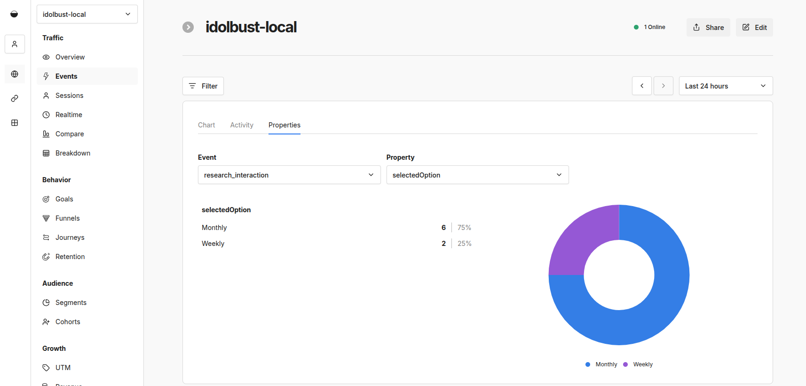

# Idol or Bust!

[](https://github.com/riehlegroup/idolbust/actions/workflows/ci.yml)
[](https://riehlegroup.github.io/idolbust/)
[](LICENSE.txt)

Easy startup websites for market research

## Quick Start

```bash
bun install
bun dev
```

Open [localhost:4321](http://localhost:4321) in your browser.

Want to migrate an existing site to using IdolBust? See [docs/migrate-existing-site.md](docs/migrate-existing-site.md) for a detailed guide and helpful worksheet templates.

## Features

- **Astro.js** - Fast static site generation with partial hydration
- **Storybook** - Component library with nice UI to browse
- **Tailwind CSS** - Utility-first styling with custom theme
- **TypeScript** - Strict mode for full type safety
- **Content Collections** - Type-safe blog posts with Zod validation
- **MDX Support** - Enhanced markdown with components
- **Interactive Inputs** - Subscription, polls, binary choice, and free-text blocks
- **RSS Feed** - Automatic feed generation (`/rss.xml`)
- **Sitemap** - SEO-friendly sitemap generation (`/sitemap-index.xml`)

## Project Structure

```
src/
├── components/      # Reusable UI components
│   ├── atoms/        # Atomic components
│   ├── molecules/    # Compound components
│   ├── organisms/    # Section components
│   └── templates/    # Page-level composition (optional)
├── layouts/         # Page layouts
├── pages/           # Routes (file-based), ignores folders and files starting with underscore
└── styles/          # Global styles
```

## Commands

| Command                                | Description                   |
| -------------------------------------- | ----------------------------- |
| `bun dev`                              | Start development server      |
| `bun run build`                        | Build for production          |
| `bun preview`                          | Preview production build      |
| `bun run lint`                         | Run ESLint                    |
| `bun run typecheck`                    | Run TypeScript check          |
| `bun storybook`                        | Start Storybook               |
| `bun storybook:build`                  | Build Storybook static site   |
| `npx vitest --project=storybook --run` | Run Storybook tests (CI/a11y) |

## Local Analytics with Umami

```bash
# create local Umami secrets
./ops/analytics/setup-local.sh

# start local Umami on http://localhost:3187
docker compose \
  -f ops/analytics/docker-compose.yml \
  --env-file ops/analytics/.env.local \
  up -d

# sign in at http://localhost:3187 with admin / umami
```

## Connect Idolbust to Umami

```bash
# create app env
cp .env.example .env

# set your Umami website ID from the UI
PUBLIC_UMAMI_WEBSITE_ID=your-website-id

# keep these local defaults
PUBLIC_UMAMI_SCRIPT_URL=http://localhost:3187/script.js
PUBLIC_UMAMI_HOST_URL=http://localhost:3187
PUBLIC_UMAMI_DOMAINS=localhost

# restart Astro after env changes
bun dev
```

## Local Newsletter with listmonk

```bash
# create local listmonk secrets
./ops/newsletter/setup-local.sh

# start local listmonk on http://localhost:9000
docker compose \
  -f ops/newsletter/docker-compose.yml \
  --env-file ops/newsletter/.env.local \
  up -d
```

Open `http://localhost:9000`, log in using `LISTMONK_ADMIN_USER` and `LISTMONK_ADMIN_PASSWORD` from `ops/newsletter/.env.local`, and create a public list.

Learned gotchas:

- `POST /api/public/subscription` only accepts UUIDs of `public` lists.
- If you see `400 Bad Request`, verify the referenced list is not `private`.
- If site and listmonk run on different origins,configure CORS allowlist in listmonk UI: `Settings > Security > CORS > Allowed origins`.

## Connect TrackedSubscriptionForm to listmonk

```bash
# create app env
cp .env.example .env

# listmonk base URL (or full /api/public/subscription endpoint)
PUBLIC_LISTMONK_API_URL=http://localhost:9000

# comma-separated list UUIDs from listmonk
PUBLIC_LISTMONK_LIST_UUIDS=replace-with-list-uuid

# restart Astro after env changes
bun dev
```

`PUBLIC_LISTMONK_API_URL` must be browser-reachable. If your site and listmonk are on different origins, allow your site origin for `POST /api/public/subscription` at your reverse proxy.

## Storybook

Storybook is configured for TSX components under `src/components/`.

```bash
bun storybook
```

Run Storybook tests (including a11y checks) from CI or locally with:

```bash
npx vitest --project=storybook --run
```

Story conventions (early stage):

- Use a single default export title that matches the component group (Atoms, Molecules, Organisms).
- Keep story names short and descriptive (Primary, WithIcon, Dense).

## Customize Branding

The site branding now comes from one source of truth: `src/pages/_brandConfig.ts`.

1. Open `src/pages/_brandConfig.ts`.
2. Update identity, organization, theme, links, navigation, footer, SEO, and blog values.
3. Keep paths aligned with your configured `base` path in `astro.config.mjs`.

For the complete typed example and current defaults, use `src/pages/_brandConfig.ts` directly.

Branding and shell notes:

- `identity.faviconType` can be set explicitly when your favicon is not SVG.
- `navigation.primary` controls top-level nav links and optional dropdown items.
- `links.appLinks` can be rendered as right-side navbar actions (for example, `Log in` / `Try for free`).
- `footer.licenseText` and `footer.legalLinks` drive footer copy and legal links.
- Social links accept known platforms (`github`, `twitter`, `linkedin`, `bluesky`) and custom identifiers.

## Site Content Pattern

Except the brand config, all data is initialized in the header of the `.astro` page files.

## Redirects After Renaming Pages

Keep renamed routes in `astro.config.mjs`:

```js
redirects: {
  "/about/": "/project/",
},
```

Remove the old page file, because file-based routes take precedence over configured redirects.

### Theming Notes

- Color tokens are exposed as CSS variables in `src/styles/global.css`.
- Tailwind color utilities (`primary-*`, `secondary-*`) map to those variables in `tailwind.config.mjs`.
- The active brand values are injected globally by `src/layouts/BaseLayout.astro`.

### Feature Cards

- `FeatureGrid` items support an optional `href`.
- When provided, `Card` renders an overlay link and applies `base`-aware URL handling for relative paths.

## Resources Collection

The template includes a `resources` collection at `src/pages/resources/_articles`.

- Use nested paths if helpful (for example `guides/interview-script-template.mdx`).
- Draft entries (`draft: true`) are excluded from both resources listing and detail routes.
- Resources are sorted by `order` (ascending), then by `updatedDate`/`pubDate` (descending).

Supported frontmatter fields:

- `title`, `description`, `category`, `pubDate`
- `updatedDate`, `tags`, `draft`, `order`
- `heroImage`, `canonical`, `seoTitle`, `seoDescription`, `ogImage`, `related`

Schema source of truth: `src/content.config.ts`.

## Interactive Components

Interactive components are available from `src/components/molecules` and can be imported from `@/components`:

- `SubscriptionForm`
- `Poll`
- `TwoWaySelection`
- `FreeTextQuestion`

`SubscriptionForm` is untracked and falls back to console logging when no custom `onSubmit` handler is provided.

Use tracked variants in MDX when you need client-side Umami custom events without writing inline callback functions:

- `TrackedPoll`
- `TrackedTwoWaySelection`
- `TrackedFreeTextQuestion`
- `TrackedSubscriptionForm`

Each component accepts an async `onSubmit` prop in React contexts and falls back to console logging if no handler is provided.

For MDX usage with Astro hydration:

```mdx
import { TrackedPoll } from "@/components";

<TrackedPoll
  client:only="react"
  eventName="research_interaction"
  optionEventKey="selectedOption"
  question="How often do you run user interviews?"
  options={["Weekly", "Monthly", "Only before major releases"]}
/>
```

`TrackedPoll` and `TrackedTwoWaySelection` support `optionEventKey` for the selected answer field. `TrackedSubscriptionForm` reads `PUBLIC_LISTMONK_API_URL` and `PUBLIC_LISTMONK_LIST_UUIDS` and submits to listmonk's `POST /api/public/subscription`. All tracked variants support `eventName` and emit three Umami events: `${eventName}_attempted`, `${eventName}_submitted`, and `${eventName}_failed`.

To see response distributions in Umami:

1. Open **Events**.
2. Switch to the **Properties** tab.
3. Select `${eventName}_submitted` in **Event** (for example `research_interaction_submitted`).
4. Select the property to analyze in **Property** (for example `selectedOption` or `responseLength`).



## Blog Articles Collection

Same as resources, but markdown files are located under `src/pages/blog/_articles`.

## Deployment

Configured for GitHub Pages. Update `astro.config.mjs` with your username:

```js
site: 'https://riehlegroup.github.io',
base: '/idolbust',
```

Pushes to `main` automatically build and deploy via the `Deploy` GitHub Actions workflow.

For CI/Deploy builds to embed production analytics/newsletter endpoints, set one GitHub Actions secret (`Settings > Secrets and variables > Actions > Secrets`) named `PUBLIC_ENV_FILE` containing these lines:

```env
PUBLIC_UMAMI_WEBSITE_ID=...
PUBLIC_UMAMI_SCRIPT_URL=https://um.idolbust.com/script.js
PUBLIC_UMAMI_HOST_URL=https://um.idolbust.com
PUBLIC_UMAMI_DOMAINS=riehlegroup.github.io
PUBLIC_LISTMONK_API_URL=https://lm.idolbust.com
PUBLIC_LISTMONK_LIST_UUIDS=comma-separated-public-list-uuids
```

The CI and Deploy workflows write this secret to a temporary `.env` file before install/build.

## License

[AGPL-3.0-or-later](LICENSE.txt)
